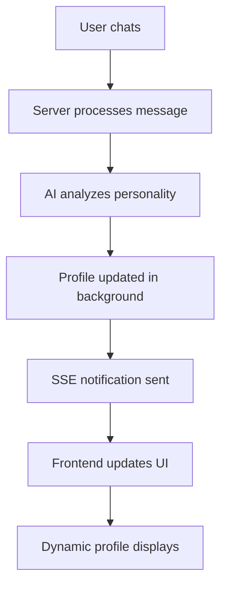
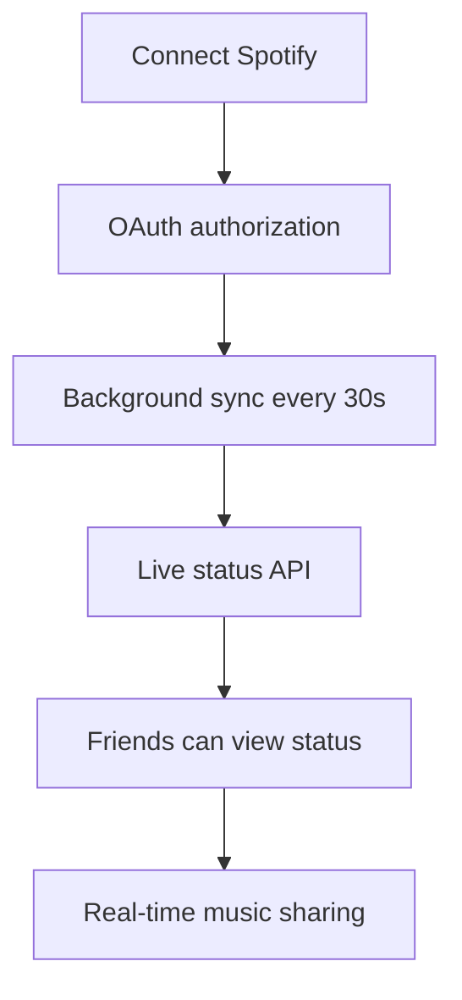

### **1. Enhanced API Services** 
- ✅ **SpotifyAPI.getLiveStatus()** - Get friends' live music status
- ✅ **NotificationsAPI** - Real-time notification support
- ✅ Enhanced **SocialProxyAPI** - Dynamic profile management

### **2. Social Proxy Hook** (`useSocialProxy.ts`)
- ✅ **Comprehensive profile management** with AI-analyzed data
- ✅ **Real-time updates** for status, plans, mood
- ✅ **Spotify integration** for music sharing
- ✅ **Activity timeline** for friend interactions
- ✅ **Automatic data fetching** and caching

### **3. New Components**

#### **SpotifyIntegration** (`SpotifyIntegration.tsx`)
- ✅ **Connect/Disconnect** Spotify accounts
- ✅ **Current track display** with album art
- ✅ **Recent favorites** showcase
- ✅ **Real-time refresh** functionality
- ✅ **Deep linking** to Spotify app

#### **DynamicProfileDisplay** (`DynamicProfileDisplay.tsx`)
- ✅ **AI-detected interests** with confidence scores
- ✅ **Communication style analysis** (casual, energetic, analytical, etc.)
- ✅ **Recent activities** tracking
- ✅ **Mood history** with energy levels
- ✅ **Profile completeness** scoring
- ✅ **Expandable sections** with smooth animations
- ✅ **Auto-refresh** capability

#### **LiveSpotifyStatus** (`LiveSpotifyStatus.tsx`)
- ✅ **Friends' live music status** viewing
- ✅ **Now playing** vs **recently played** detection
- ✅ **30-second auto-refresh** for live updates
- ✅ **Compact mode** for friend lists
- ✅ **Error handling** for permissions/privacy
- ✅ **Time-ago formatting** for status age

### **4. Enhanced SSE Service** (`sseService.ts`)
- ✅ **Profile update notifications** 
- ✅ **Spotify status change alerts**
- ✅ **Friend activity notifications**
- ✅ **Real-time connection management**

### **5. Updated ProfileScreen**
- ✅ **Integrated all new components**
- ✅ **Social proxy data binding**
- ✅ **Real-time updates** on profile changes
- ✅ **Spotify connection management**
- ✅ **Dynamic profile analysis display**

## 🔧 How It Works

### **Frontend-Backend Flow:**


### **Spotify Integration Flow:**


## 🎮 User Experience Features

### **Instant Feedback:**
- Chat responses are **immediate** (no blocking)
- Profile analysis happens **asynchronously**
- Users get **real-time notifications** when profile updates

### **Live Music Integration:**
- **Connect Spotify** in one tap
- **Live status** visible to friends
- **Automatic music sharing** with context
- **Privacy controls** for who sees what

### **Smart Profile Building:**
- **AI learns** from every conversation
- **Interests detected** with confidence scores
- **Communication style** analysis
- **Activity tracking** over time
- **Mood detection** and history

### **Social Features:**
- **Friends can see** live music status
- **Profile completeness** scoring
- **Recent activity** sharing
- **Privacy-first** design

## 📱 Components Usage

### **In ProfileScreen:**
```tsx
{/* Spotify Integration */}
<SpotifyIntegration
  spotifyData={socialProxyProfile?.spotify}
  onStatusChange={refreshSocialProxy}
/>

{/* Dynamic AI Profile */}
<DynamicProfileDisplay
  personality={socialProxyProfile?.personality}
  loading={socialProxyLoading}
  onRefresh={refreshSocialProxy}
/>
```

### **In FriendsScreen:**
```tsx
{/* Friend's Live Music Status */}
<LiveSpotifyStatus
  username={friend.username}
  compact={true}
/>
```

## 🔮 What Users See

### **Profile Analysis Results:**
- 🎯 **Interests**: "programming (95%), AI development (89%), React Native (82%)"
- 💬 **Communication Style**: "Casual: 75%, Energetic: 68%, Analytical: 91%"
- 🎵 **Current Track**: "Currently listening to 'Bohemian Rhapsody' by Queen"
- 📊 **Profile Completeness**: "87% complete"

### **Live Friend Status:**
- 🎶 "Alex is listening to 'Shape of You' by Ed Sheeran (2m ago)"
- 🔄 "Auto-refreshes every 30 seconds"
- 🔗 "Tap to open in Spotify"

### **Real-Time Updates:**
- 📢 "Your profile was updated based on recent conversations"
- 🎵 "Your music status was updated"
- 👥 "Sarah updated their status"

## 🚀 Ready to Test!

**The complete dynamic AI profile system is now implemented on the frontend!**

### **Next Steps:**
1. **Test Profile Analysis** - Chat with Aether and watch your interests get detected
2. **Connect Spotify** - Link your account and see live music status
3. **Add Friends** - View their live Spotify status
4. **Check Notifications** - Get real-time updates on profile changes

### **Backend Integration Points:**
- ✅ `/social-proxy/profile` - Dynamic profile data
- ✅ `/spotify/*` - All Spotify endpoints
- ✅ `/notifications/stream` - Real-time updates
- ✅ Profile analysis queue - Background processing
